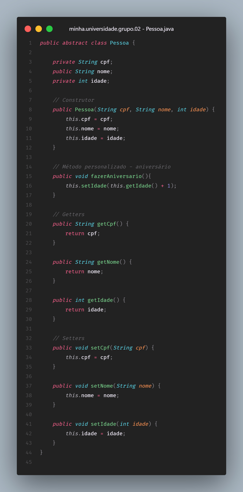
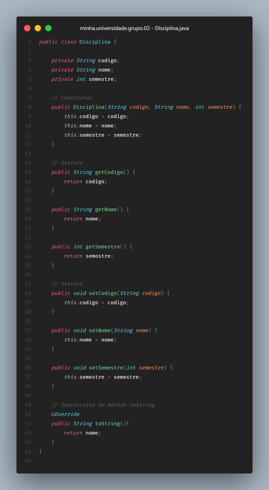

# Classes e Objetos
  
> **Questão 1:** Classes e Objetos: Crie uma classe abstrata chamada “Pessoa” que represente um ser humano. Pessoa deve ter atributos como “cpf”, “nome” e “idade”. Implemente os métodos para definir e obter esses atributos. Crie uma classe “Disciplina” com os atributos como “código”, “nome” e “semestre”.
  

  

  