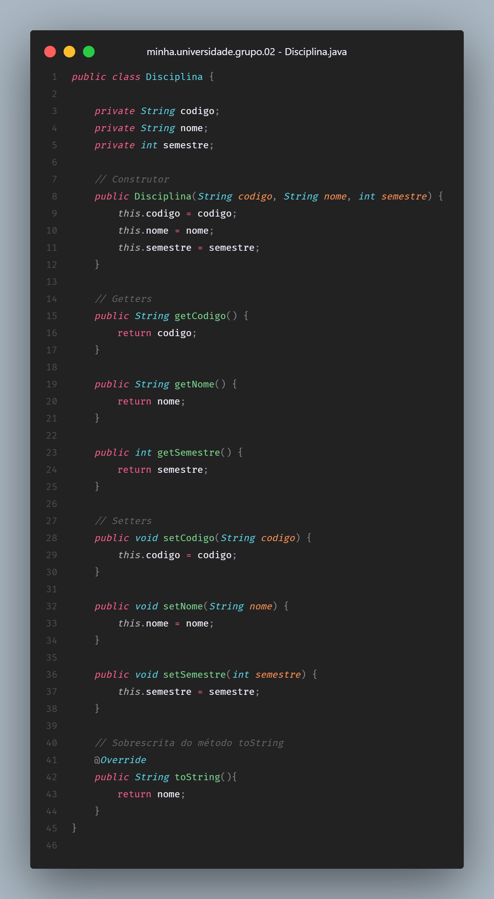
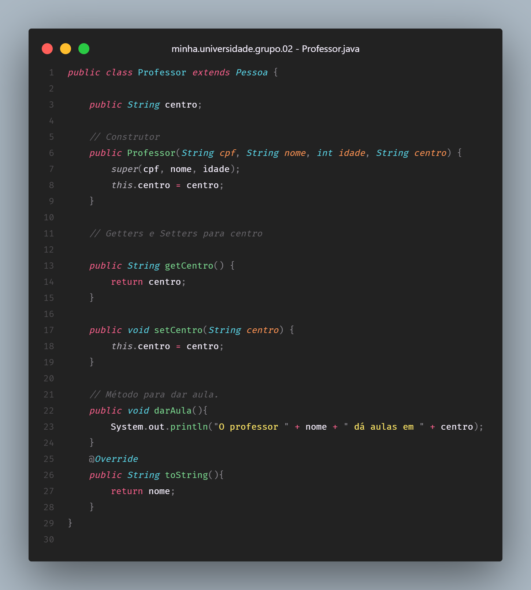

# Classes e Objetos
> **Questão 1:** Classes e Objetos: Crie uma classe abstrata chamada “Pessoa” que represente um ser humano. Pessoa deve ter atributos como “cpf”, “nome” e “idade”. Implemente os métodos para definir e obter esses atributos. Crie uma classe “Disciplina” com os atributos como “código”, “nome” e “semestre”.

 

 

# Encapsulamento e Métodos
> **Questão 2:** Encapsulamento e Métodos: Evolua a classe “Pessoa”
adicionando um método público para incrementar a idade da pessoa. Crie um método público chamado “fazerAniversario”.

 

# Herança e Polimorfismo
> **Questão 3:** Herança e Polimorfismo: Crie 3 classes derivadas de “Pessoa”, são elas: “Visitante”, “Aluno” e “Professor”. Adicione um atributo “matrícula” para a classe “Aluno” e um método “pagarMensalidade”. Adicione um atributo “centro” para a classe “Professor” e um método “darAula”. Crie 2 classes derivadas de “Aluno”, são elas: “Bolsista” e “Regular” e faça uma sobreposição no método “pagarMensalidade” para ambas as classes.

 

 

 

 

 

# Associação e Composição
> **Questão 4:** Associação e Composição: Crie uma classe, chamada “Turma”. Adicione em turma os atributos “código”, “disciplina”, “professor” e “alunos”, crie os métodos “adicionarAluno”, “removerAluno” e “listarAlunos” e os implemente utilizando ArrayList. Cada atributo será do tipo da classe de mesmo nome, exceto alunos que terá uma lista de objetos do tipo “Aluno”.

 

