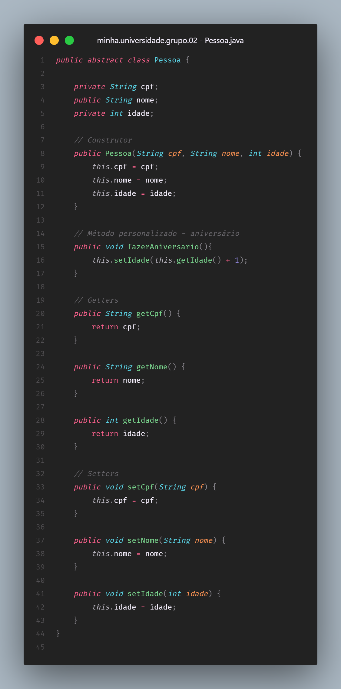

# Encapsulamento e Métodos

> **Questão 2:** Encapsulamento e Métodos: Evolua a classe “Pessoa”
adicionando um método público para incrementar a idade da pessoa. Crie um método público chamado “fazerAniversario”.

 

