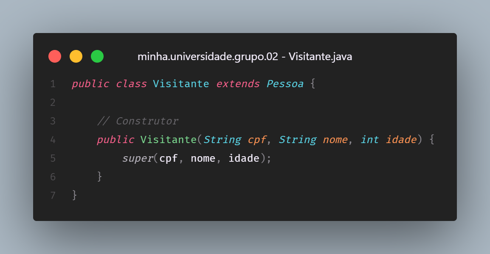
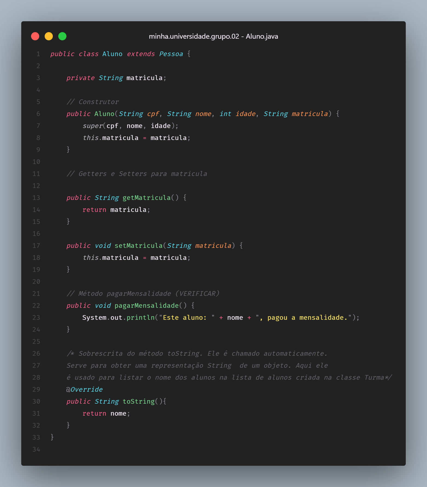
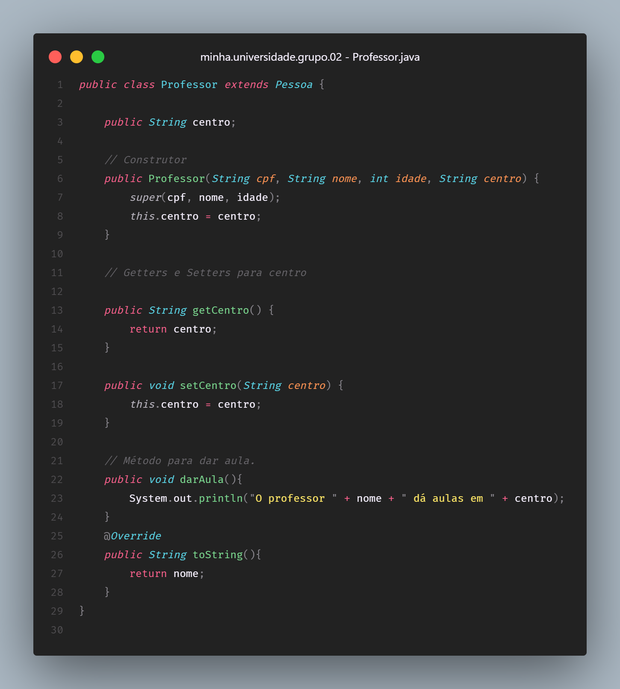
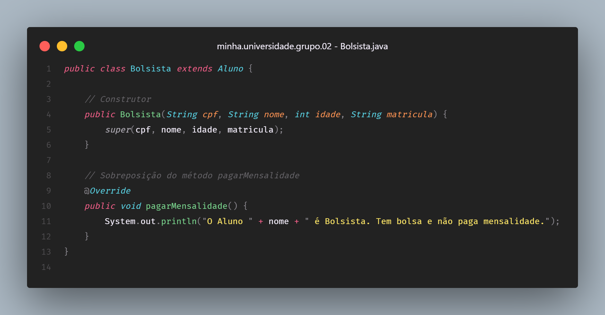
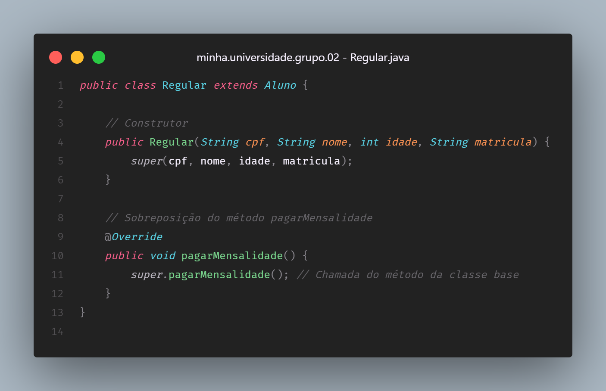

# Herança e Polimorfismo

> **Questão 3:** Herança e Polimorfismo: Crie 3 classes derivadas de “Pessoa”, são elas: “Visitante”, “Aluno” e “Professor”. Adicione um atributo “matrícula” para a classe “Aluno” e um método “pagarMensalidade”. Adicione um atributo “centro” para a classe “Professor” e um método “darAula”. Crie 2 classes derivadas de “Aluno”, são elas: “Bolsista” e “Regular” e faça uma sobreposição no método “pagarMensalidade” para ambas as classes.

 

 

 

 

 

